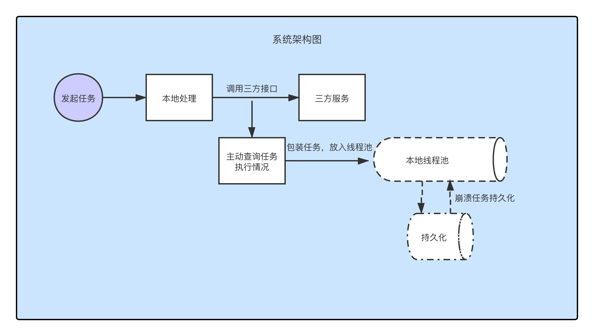

# async-task 异步任务框架

### 是做什么的？
异步任务框架,解决了异步任务无法实时拿到请求结果的问题,减少对定时任务依赖,达到"异步请求变同步"的效果。
### 项目架构图

### Maven
异步任务框架已经部署到公司Maven仓库
Latest Snapshot Version:
```maven
    <dependency>
        <groupId>com.baijia</groupId>
        <artifactId>async-task</artifactId>
        <version>1.0.0-SNAPSHOT</version>
    </dependency>
```
Latest Snapshot Version:
    暂未发布稳定版本, 请期待更新

### 快速开始
以SpringBoot为例,配置过程如下:
将AsyncTaskConfig加入配置对象,并设置核心线程池数量以及配置自定义持久化实现类所在的包路径
```java
@Configuration
public class AsyncTaskConfig {

    @Bean(name = "asyncTaskApplicationConfig")
    public AsyncTaskApplicationConfig asyncTaskApplicationConfig() {
        AsyncTaskApplicationConfig asyncTaskApplicationConfig = new AsyncTaskApplicationConfig();
        //自定义配置核心线程池数量
        asyncTaskApplicationConfig.setCorePoolSize(150);
        //配置自定义持久化实现类所在的包路径
        asyncTaskApplicationConfig.setPersistenceHandlerPackagePath("com.baijia.uqun.sales.task.config.*");
        return asyncTaskApplicationConfig;
    }
}
```
实现类实例如下:
```java
@ATExecutorConfig(maxExecuteCount = 4, maxTimeOutSeconds = 3600, compensateRateSeconds = 30)
public class DemoAsyncTaskHandler extends AbstractAsyncTaskHandler<Object, Object> {
    @Override
    protected Object processor(Object o) {
        System.out.println("[主任务]邀请1001用户进群...");
        return o;
    }

    @Override
    protected Boolean postCompensateProcessor(Object o) {
        System.out.println("[补偿任务] 查询1001用户是否在群内: 不在!");
        return new Random().nextBoolean();
    }
}
```